# 1. LÀM CHỦ PYTHON - First Lesson (2:30 a.m. 21/12/20230)
## 1.1 Các kiểu dữ liệu cơ bản trong Python
- **Int:** Kiểu số nguyên ( Không có chứa dấu chấm thập phân), có thể là các số dương hoặc âm
Ví dụ: 113, -114
- **float:** Kiểu số thực ( có chứa dấu chấm thập phân), có thể là số dương hoặc âm
Ví dụ: 5.2, 7,3
- **Kiểu complex:** Kiểu số phức,
    - Vd 1: z = 2+3j thì 2 là phần thực, 3 là phần ảo (j là từ khóa để đánh dấu phần ảo)
    - Vd 2: z = complex(2,3) thì 2 là phần thực, 3 là phần ảo
    - Khi xuất kết quả ta có thể xuất ra bằng các cú pháp:
        - print("Phần thực:",z.real) ==> Phần thực: 2
        - print("Phần ảo:", z.imag) ==> Phần ảo: 3
- **Kiểu str:** Kiểu chuỗi, để trong nháy đôi hoặc nháy đơn
Ví dụ: "Obama", "Thành Đẹp Trai"
- **Kiểu bool:** Kiểu luận lý, để lưu True hoặc False
Ví dụ: t1: True
        t2: False
## 1.2 Khai báo biến trong Python
- Khác với C, C++ thì Python đầu vào dữ liệu không cần phải nhập kiểu dữ liệu. Python sẽ tự động nhận diện và gán biến. 
- Trong Python sử dụng **type()** để xem kiểu dữ liệu
    Ví dụ: x = 5
    print(type(x))
## 1.3 Cách xóa biến
<pre>
```
x ="Thanhdeptrai"
print(x)
**del x**
```
</pre>
## 1.4 Ghi chú khi lập trình
### 1.4.1 Vì sao nên ghi chú khi lập trình?
- Thể hiện tính chuyên nghiệp của Lập trình viên. Nếu không thì khả năng bị loại khi sinh việc là cực cao. 
-> Giỏi không đi đôi với cẩu thả
- Dễ dàng cho Lập trình viên và teamate đọc lại sau này
### 1.4.2 Ghi chú 1 dòng
- dùng dấu # để ghi chú 1 dòng
### 1.4.3 Ghi chú nhiều dòng
- Dùng dầu ''' để khi chú nhiều dòng
## 1.5 Các toán tử thường dùng trong Python
### 1.5.1 Toán tử số học cơ bản
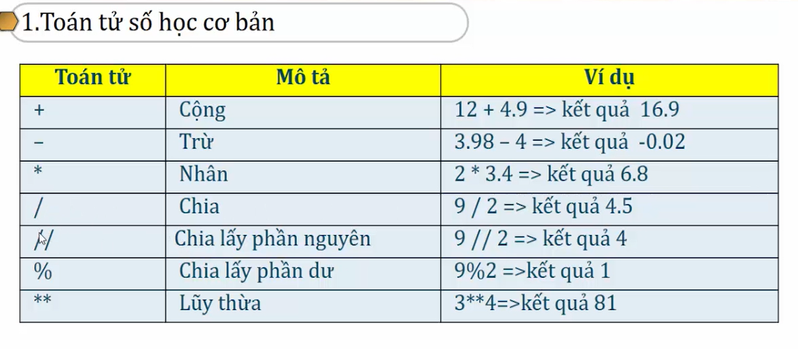
### 1.5.2 Toán tử gán

### 1.5.3 Toán tử so sánh

### 1.5.4 Toán tử Logic
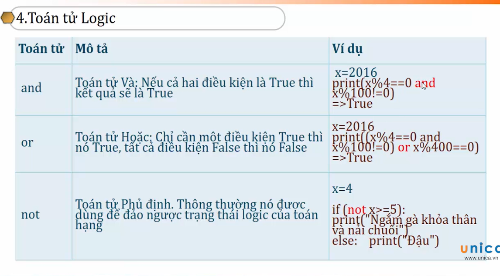
### 1.5.5 Độ ưu tiên toán tử
Dùng ngoặc () để ưu tiên nhóm nào làm trước
## 1.6 Cách nhập liệu từ bàn phím trong Python
- Nhập bằng input(), đầu ra hiểu bằng chuỗi. 
<pre>
```
**Ví dụ 1:** Cách nhập thông thường
print("Mời bạn nhập str:")
x = input()
```
</pre>
**Ví dụ 2:** Cách nhập định dạng luôn kiểu của giá trị nhập 
<pre>
```
x = int(input())
x = float(input())
```
</pre>
## 1.7 Cách xuất dữ liệu 
### 1.7.1 Cách xuất dữ liệu nhiều lần
<pre>
```
print('*'*15)
```
</pre>

<pre>
```
**Kết quả:**
***************
```
</pre>
### 1.7.2 Format giá trị
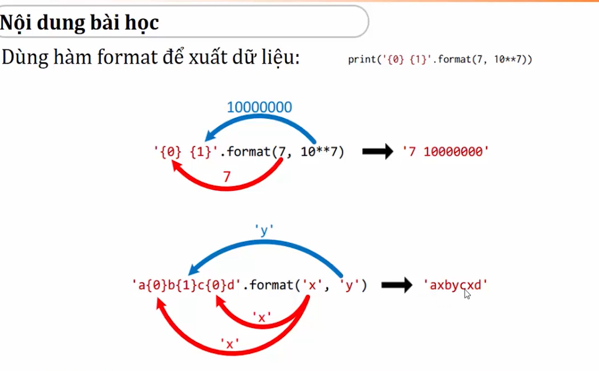
<pre>
```
**Input**
print('-'* 20)
print('{0:^4} {1:>15}'.format('STT', 'Giá tri'))
print('-'* 20)
print('{0:>4} {1:>15}'.format(1, 10**10)) #Căn phải
print('{0:^4} {1:>15}'.format(2, 10**9)) #Căn giữa
print('{0:<4} {1:>15}'.format(3, 10**8)) # Căn trái
print('{0:^4} {1:>15}'.format(4, 10**7))
print('{0:^4} {1:>15}'.format(5, 10**6))
print('{0:^4} {1:>15}'.format(6, 10**5))
print('{0:^4} {1:>15}'.format(7, 10**4))
print('{0:^4} {1:>15}'.format(8, 10**3))
print('{0:^4} {1:>15}'.format(9, 10**2))
print('{0:^4} {1:>15}'.format(10, 10**1))
print('-'* 20)
```
</pre>

<pre>
```
**Output**
--------------------
STT          Giá tri
--------------------
   1     10000000000
 2        1000000000
3          100000000
 4          10000000
 5           1000000
 6            100000
 7             10000
 8              1000
 9               100
 10               10
--------------------
```
</pre>
## 1.8 Các loại lỗi khác nhau - VIDEO 09
- Lỗi cú pháp: Lỗi cho Amateur
- Lỗi thực thi
- Lỗi logic- Lỗi Nghiệp Vụ
-> Làm sao để bắt lỗi?
## 1.9 Bài tập rèn luyện, tính chu vi diện tích hình tròn - VIDEO 10
**Đề bài:** Nhập bán kính đường tròn r. Tính và xuất chu vi, diện tích đường tròn tương ứng
<pre>
```
**Code**
r = float(input("Mời bạn nhập bán kính đường tròn:"))
cv = round(r*2*math.pi, 3)
s = round(math.pi*r, 3)
print("Chu vi của đường tròn là:", cv)
print("Diện tích đường tròn là:", s)
```
</pre>

## 1.10 Bài tập rèn luyện - Tính giờ phút giây - Video 11
**Đề bài:** Nhập vào số giây bất kỳ t. Tính và xuất ra dạng Gio:Phut:Giay
**Ví dụ:** 
- Nhập 3750 thì xuất ra 1:02:30 AM
- Nhập 51100 thì xuất ra 1:11:40 PM
**Hướng dẫn:**
hour = (t/3600)%24
minute = (t%3600)/60
second = (t%3600)%60
<pre>
```
**Code:**
t = int(input("Mời bạn nhập số giây:"))
hour = (t//3600)%24
minute = (t%3600)//60
second = (t%3600)%60
print('{0}:{1}:{2}'.format(hour, minute, second))
```
</pre>

## 1.11 Bài tập rèn luyện: Tính điểm trung bình
**Đề bài:** Viết chương trình nhập vào điểm ba môn Toán, Lý, Hóa của một học sinh. In ra điểm trung bình của học sinh đó với hai số lẻ thập phân.
<pre>
```
**Code:**
diem_toan = float(input("Moi ban nhap diem mon toan:"))
diem_ly = float(input("Moi ban nhap diem mon ly:"))
diem_hoa = float(input("Moi ban nhap diem mon hoa:"))
diem_trung_binh = (diem_toan + diem_ly + diem_hoa)/3
print("Diem trung binh cua ban la:", round(diem_trung_binh, 2))
```
</pre>

## 1.12 Biểu thức Boolean
- Biểu thức Boolean ( Boolean Expression) còn đucợ gọi là Predicate. Là một biểu thức rất quan trọng và phổ biến trong các lệnh của Python cũng như ngôn ngữ lập trình khác. 
- Các giá trị là True hoặc False, dựa vào các giá trị này mà ta điều hướng các công việc trong phần mềm
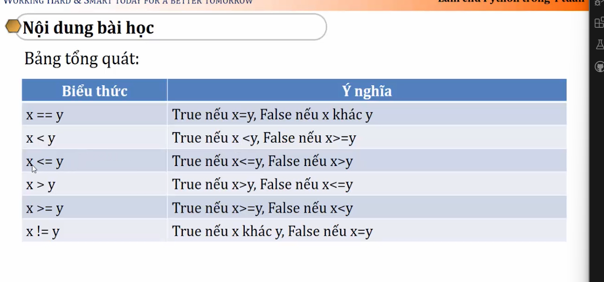
## 1.13 Biểu thức If
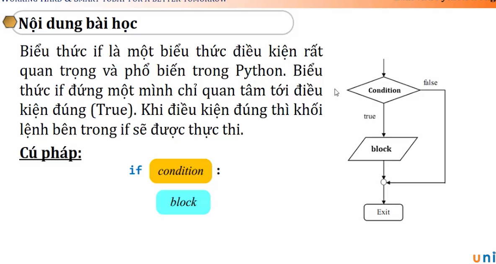

<pre>
```
**Code:**
diem_toan = float(input("Moi ban nhap diem mon toan:"))
diem_ly = float(input("Moi ban nhap diem mon ly:"))
diem_hoa = float(input("Moi ban nhap diem mon hoa:"))
diem_trung_binh = (diem_toan + diem_ly + diem_hoa)/3

print("Diem trung binh cua ban la:", round(diem_trung_binh, 2))

if diem_trung_binh >= 8.0:
    print("Chuc mung ban la hoc sinh gioi!")
elif 8.0> diem_trung_binh >= 6.5:
    print("Chuc mung ban hoc sinh kha!")
elif 6.5 > diem_trung_binh >= 5.0:
    print("Chuc mung ban hoc sinh kem!") 
else:
    print("Chuc mung ban se o lai lop!")
```
</pre>

## 1.14 Biểu thức If...else
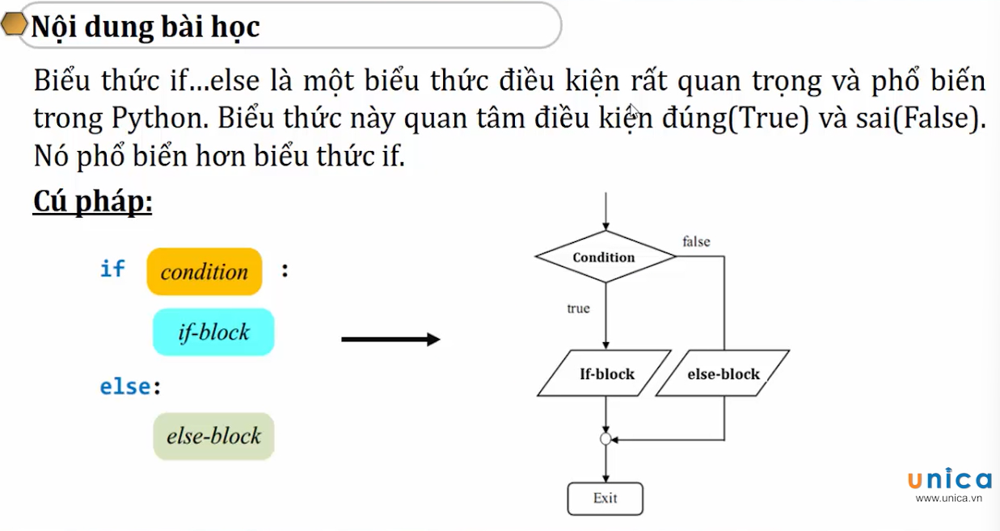
## 1.15 Biểu thức If...elif...else
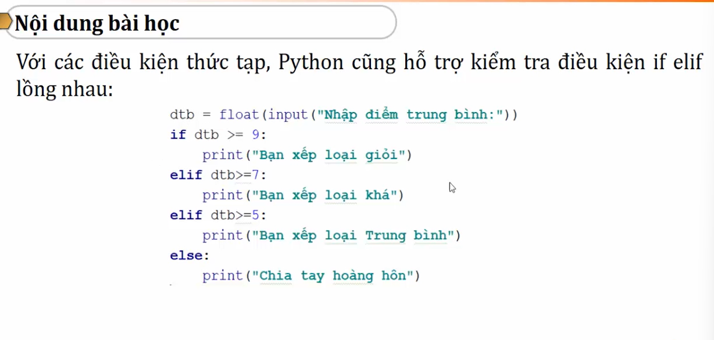
## 1.16 Biểu thức pass
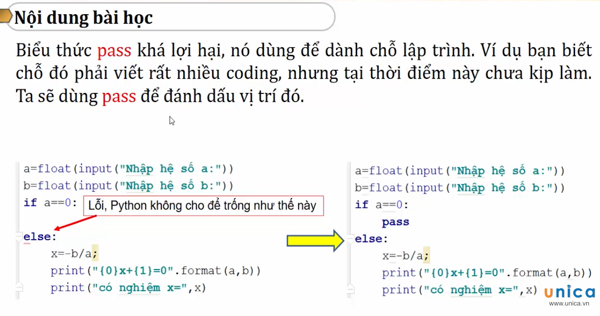
## 1.17 So sánh số thực trong Python
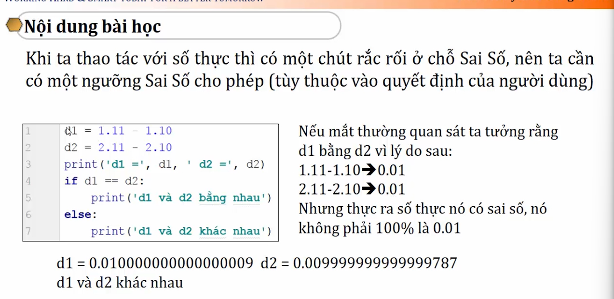
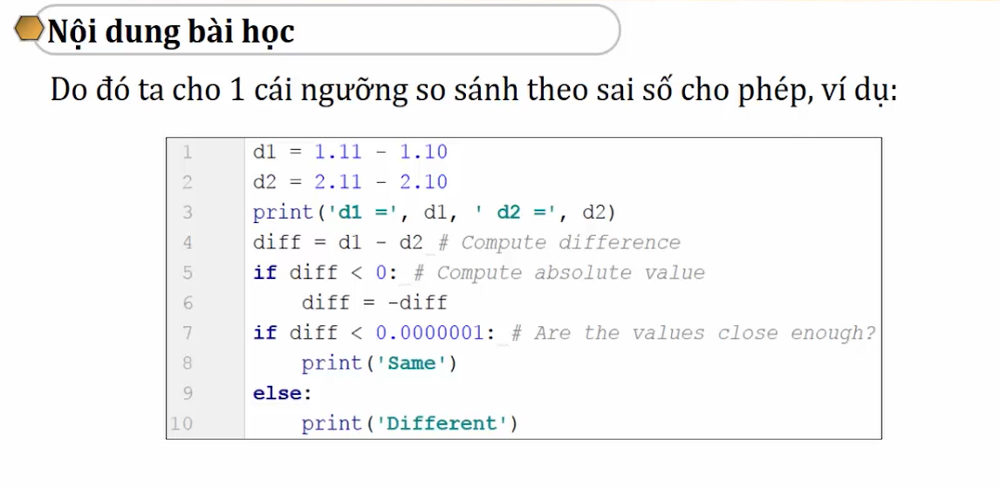
## 1.18 Sử dụng If else như một phép gán
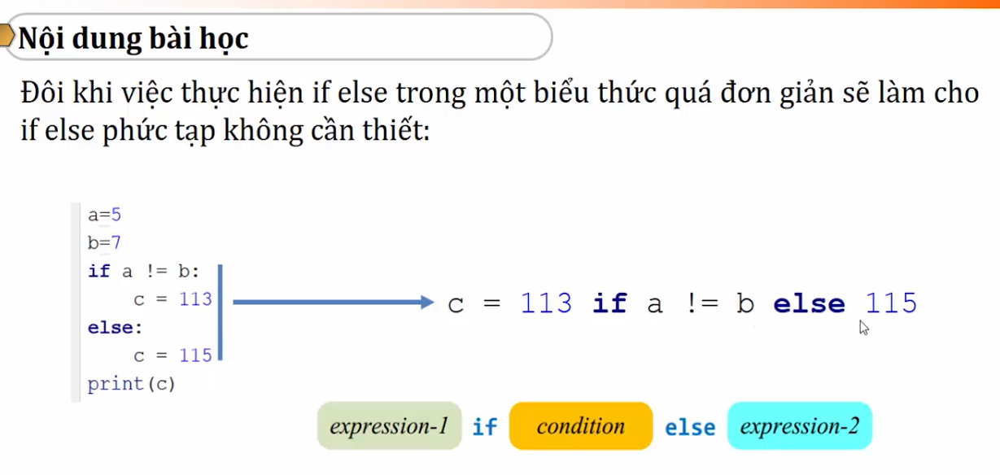
<pre>
```
**Code:**
a = int(input("Mời bạn nhập số cần kiểm tra:"))
d = a/2
b = a//2

c = "Số chẵn" if b == d else "Số lẻ"
print(c)
```
</pre>
# 1.19 Bài tập rèn luyện: Kiểm tra năm nhuần
**Đề bài:** Nhập vào một năm bất kỳ, kiểm tra năm đó có phải năm nhuần hay không. Biết rằng: Năm nhuần là năm chia hết cho 4 nhưng không chia hết cho 100 hoặc chia hết cho 400
<pre>
```
**Code tu lam:**
nam = int(input("Nhap nam can kiem tra:"))
kiem_tra = nam/4
kiem_tra2 = nam//4
kiem_tra3 = nam/100
kiem_tra4 = nam//100
if kiem_tra == kiem_tra2 and kiem_tra3 != kiem_tra4:
    print("Nam nhuan")
else: 
    print("Nam khong nhuan")
```
</pre>

<pre>
```
**Code chuan:**
year = int(input("Moi ban nhap nam can kiem tra:"))
if (year % 4 == 0 and year % 100 != 0) or year % 400 == 0:
    print("Nam nhuan")
else:
    print("Nam khong nhuan")
```
</pre>


Coi tiếp ở video 22
Pass giải nén: http://nhasachtinhoc.blogspot.com
kkkkkkk